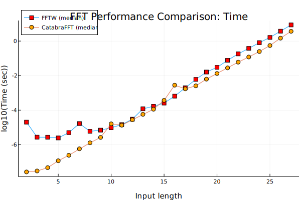
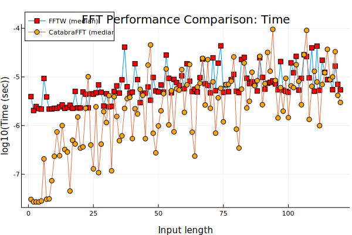

# CatabraFFT

[](https://pitsianis.github.io/`CatabraFFT.jl`/stable/)
[](https://pitsianis.github.io/`CatabraFFT.jl`/dev/)
[](https://github.com/pitsianis/`CatabraFFT.jl`/actions/workflows/CI.yml?query=branch%3Amain)
[](https://codecov.io/gh/pitsianis/`CatabraFFT.jl`)





`CatabraFFT.jl` is a tool that auto-generates (for now) one-dimensional complex fast Fourier transform kernels for any arbitrary size. It makes use of hardware resources to produce FFT kernels calibrated for SIMD-friendly instructions using the metaprogramming features of the Julia compiler.

The sequential performance of `CatabraFFT.jl` rivals the sequential performance of the celebrated [`FFTW`](https://github.com/FFTW/fftw3) library.

The `CatabraFFT.jl` project, proposes a framework of producing auto-generated high-performance FFT kernels as codelet segments combined together as boosted
functions, written using only the Julia programming language. In contrast, `FFTW` is a C library that uses codelets produced by a generator implemented in Objective CaML (OCaML), requiring special knowledge and tools.

`CatabraFFT.jl` is separated in two stages; The first stage is pre-compilation, given the signal length, a plan of symbolic instructions is generated. After a symbolic representation of the chosen function is set, called the *plan* of the function, the plan is converted to actual code segments that make a part of the final optimal function `CatabraFFT.jl` designed to use.

Depending on the signal length `n`, the first criterion of the code creator is whether `n` belongs to the domain of values `2^a` , `3^b` `5^c` or `7^d`. The powers of these single digit primes are accelerated since there are already hand-written codelets of given radix-n size that
can be properly placed to construct unrolled linear functions.

If `n = 2^a ∗ 3^b ∗ 5^c ∗ 7^d` then the mixed-radix formulation is applied where input
size `n` is broken down to the greatest common divisor (gcd), `n = n_1 ∗ n_2`. This way, since we know that `n_1 ∪ n_2 ∈
{2^a , 3^b , 5^c , 7^d }` the family of accelerated codelets fits to the two sub-lengths.

In the case of the set of other non-prime integers, a previously deduced recursive approach of the mixed-radix formulation is applied, breaking
down the initial `n` length down to cached-in precomputed codelet fits, or just prime length sub-problems.

Finally, in the case of prime-sized input signals, we apply Rader’s FFT algorithm.

The second stage consists of using all pre-computed assets and create aa highly efficient FFT implementation that is competitive with peak  FFT libraries like FFTW.

## Run Code

You can install the (currently unregistered) package with
```julia
using Pkg
Pkg.add(url="https://github.com/AUTh-CSAL/CatabraFFT.jl")
using CatabraFFT
y = CatabraFFT.fft(x)
z = CatabraFFT.ifft(y)
```

## Benchmarks

There are bencharks in `benchmark/benchmarks.jl` that compare the performance of `CatabraFFT.jl` with [`FFTW`](https://github.com/FFTW/fftw3) library via the Julia bindings provided by [`FFTW.jl`](https://github.com/JuliaMath/FFTW.jl). If you want to run the benchmarks, clone the repository 
issuing 
```shell
git clone https://github.com/AUTh-CSAL/CatabraFFT.jl.git
cd CatabraFFT.jl
julia --threads=1
``` 
press `]` to enter the package manager (and backspace to exit it when done), and run the following commands in the Julia REPL:

```julia
] activate benchmarks
] develop .
include("benchmarks/benchmark.jl")
```

## References

* [FFTW](https://www.fftw.org)
* Nikos P. Pitsianis. 1997. [The Kronecker product in approximation and fast transform generation](https://users.cs.duke.edu/~nikos/reprints/T-001-KronProdApprox.pdf). Ph.D. Dissertation. Cornell University, USA. https://dl.acm.org/doi/10.5555/266698
* [Spiral](https://www.spiral.net)