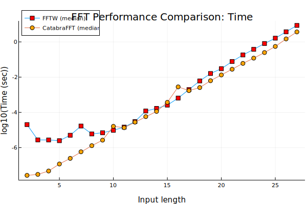

# CatabraFFT

[](https://pitsianis.github.io/CatabraFFT.jl/stable/)
[](https://pitsianis.github.io/CatabraFFT.jl/dev/)
[](https://github.com/pitsianis/CatabraFFT.jl/actions/workflows/CI.yml?query=branch%3Amain)
[](https://codecov.io/gh/pitsianis/CatabraFFT.jl)





CATABRA is a tool that auto-generates FFT kernels for any arbitrart size. It makes use of hardware resources to run FFT kernels calibrated for each special features such as
SIMD-friendly instructions using metaprogramming features of the Julia compiler. The performance of CATABRA rivals that of FFTW.

The Catabra project, proposes a framework of
producing auto-generated high-performance FFT kernels as codelet segments combined together as boosted
functions, all written using only the Julia programming language.
It is separated in two stages; The first stage is the on of pre-complication where, given the signal length,
a plan of symbolic instruction is generated. In this stage, given only the length of the signal. Depending on the signal length n integer,
the first criterion of the code creator is whether n belogns to the domain of values ```2^a``` , ```3^b``` ```5^c``` or ```7^d``` . The powers
of these single digit primes have to do that there are already hand-written codelets of given radix-n size that
can be properly placed to construct unrolled linear function deduced by dynamic programming methods,
especially accelerated via explicit SIMD commands.

If ```n = 2^a ∗ 3^b ∗ 5^c ∗ 7^d``` then the mixed-radix where input
size n is broken down to the greates common divisor (gcd), ```n = n_1 ∗ n_2``` . This way, since we know that ```n_1 ∪ n_2 ∈
{2^a , 3^b , 5^c , 7^d }``` the family of accelerated codelets fits to the two sub-lenghts. In the case of a higher non-prime
integer legnth a previously deduced recursive apprach of the mixed-radix formulation is applied, breaking
down the initial n length down cached-in precomputed codelet fits, or a prime lenght sub-problem. Finally, in
the case of prime inputs we apply Rader’s FFT algorithms for prime signal sizes.

The second stage consists of using all pre-computed assets and create actually competitive runtime fitness
scores with peak vendor-specific FFT libraries.

## Run Code

In ```/src/main.jl```, call the ```test(n)``` function for any integer ```n```.

Run  ```benchmark_fft_over_range(xs)``` to benchmark a range of values ```xs```. This will produce a plot of time and memory graph.

You can view the plots by installing the VS Code Julia Extention.